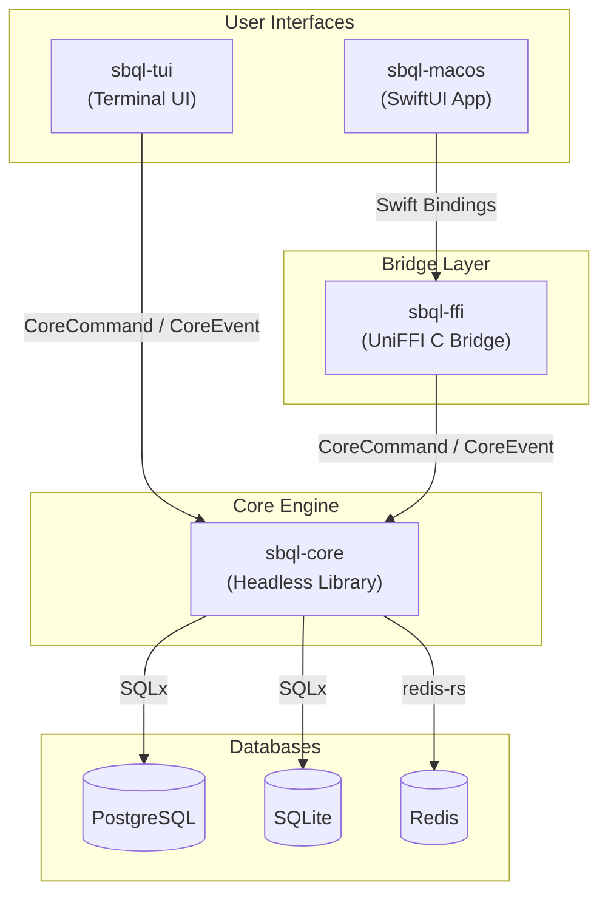
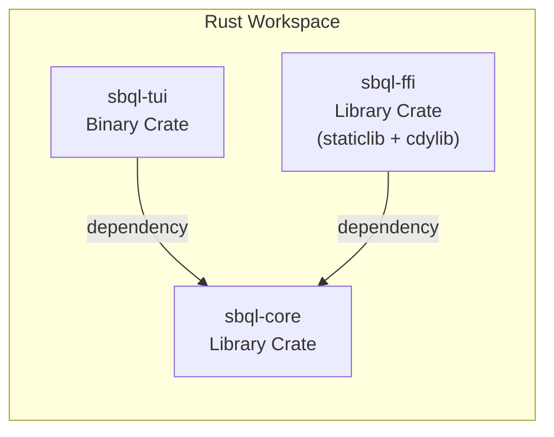
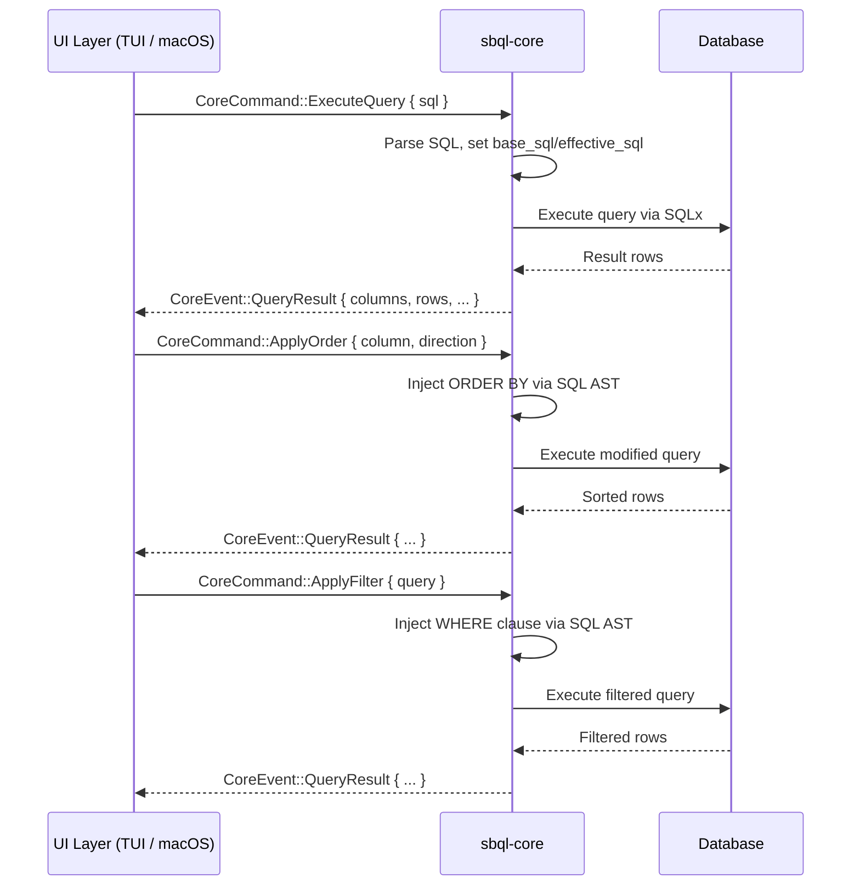
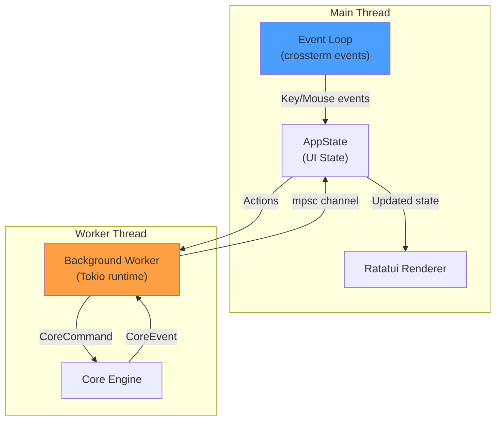
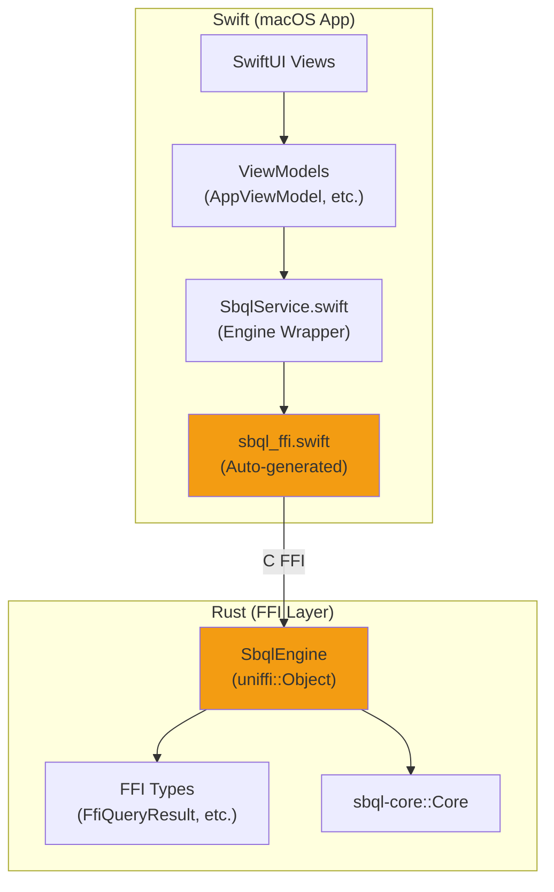
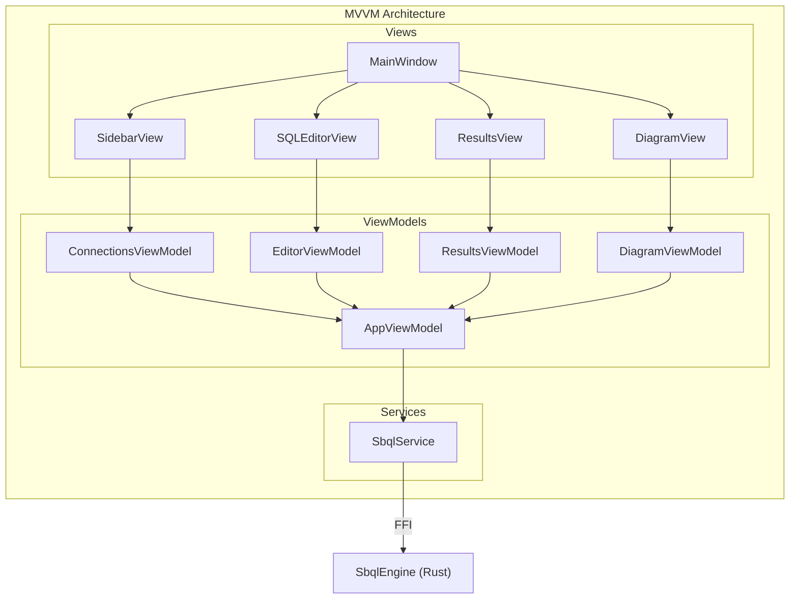
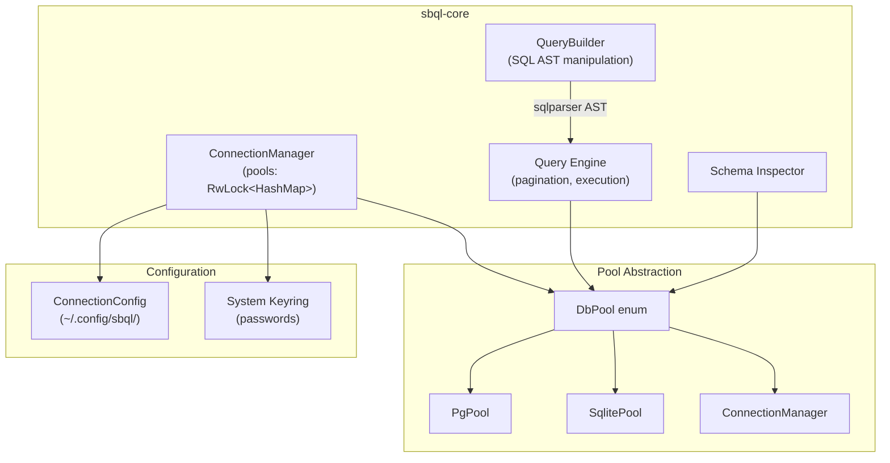
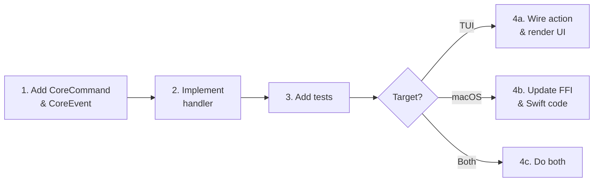

# Contributing to sbql

Thank you for your interest in contributing to sbql! This guide will help you understand the project architecture, set up your development environment, and start contributing.

## Table of Contents

- [Project Overview](#project-overview)
- [Architecture](#architecture)
  - [High-Level Architecture](#high-level-architecture)
  - [Crate Structure](#crate-structure)
  - [Data Flow](#data-flow)
  - [TUI Event Loop](#tui-event-loop)
  - [FFI Bridge (Rust ↔ Swift)](#ffi-bridge-rust--swift)
  - [macOS App Architecture](#macos-app-architecture)
  - [Database Layer](#database-layer)
- [Directory Structure](#directory-structure)
- [Getting Started](#getting-started)
- [Development Workflow](#development-workflow)
- [Testing](#testing)
- [Building the macOS App](#building-the-macos-app)
- [Code Style](#code-style)

---

## Project Overview

sbql is a multi-platform SQL workspace that provides both a terminal UI (TUI) and a native macOS app for managing database connections, running queries, and visualizing schemas. It supports PostgreSQL, SQLite, and Redis.

---

## Architecture

### High-Level Architecture



The project follows a **headless core** pattern. All database logic, SQL parsing, and state management live in `sbql-core`. The UI layers (`sbql-tui` and `sbql-macos`) are thin clients that send commands and react to events.

---

### Crate Structure



| Crate | Type | Purpose |
|-------|------|---------|
| `sbql-core` | `lib` | UI-agnostic core: connection management, query execution, SQL AST manipulation, schema introspection |
| `sbql-tui` | `bin` | Terminal interface with Ratatui, background worker thread for async operations |
| `sbql-ffi` | `lib` (staticlib/cdylib) | UniFFI bridge exposing `sbql-core` to Swift via C FFI |

---

### Data Flow

The core uses a **Command/Event** pattern for all communication:



**Key commands:**

| Command | Description |
|---------|-------------|
| `SaveConnection` | Save connection config to disk |
| `Connect` | Open a database connection pool |
| `Disconnect` | Close a connection pool |
| `ExecuteQuery` | Run a SQL query with pagination |
| `FetchPage` | Fetch a specific page of results |
| `ApplyOrder` | Add/modify ORDER BY via AST manipulation |
| `ApplyFilter` | Add WHERE clause via AST manipulation |
| `UpdateCell` | Update a single cell value |
| `DeleteRow` | Delete a row by primary key |
| `ListTables` | List all tables in the schema |
| `LoadDiagram` | Load schema diagram data |

---

### TUI Event Loop



The TUI uses a dedicated worker thread with its own Tokio runtime. This keeps the UI responsive while queries execute:

1. **Main thread**: Handles terminal events (keyboard, mouse), updates `AppState`, renders UI
2. **Worker thread**: Receives `CoreCommand`s via channel, executes them on `Core`, sends back `CoreEvent`s
3. Communication uses `mpsc` channels for thread-safe message passing

---

### FFI Bridge (Rust ↔ Swift)



The FFI bridge uses [UniFFI](https://github.com/mozilla/uniffi-rs) to generate Swift bindings:

1. `sbql-ffi` defines `SbqlEngine` with `#[uniffi::export]`
2. Build script compiles Rust for both `aarch64` and `x86_64` architectures
3. Creates a universal binary with `lipo`
4. UniFFI generates `sbql_ffi.swift` with type-safe Swift bindings
5. Packages as `SbqlFFI.xcframework` for Xcode consumption

---

### macOS App Architecture



The macOS app follows **MVVM** (Model-View-ViewModel):
- **Views**: SwiftUI declarative components
- **ViewModels**: `@Observable` classes managing UI state
- **Services**: `SbqlService` wraps the FFI engine for async Swift calls

---

### Database Layer



Key design decisions:
- **`DbPool` enum**: Wraps PostgreSQL, SQLite, and Redis pools behind a unified interface
- **SQL AST manipulation**: Uses `sqlparser-rs` to inject ORDER BY and WHERE clauses without string concatenation
- **Credential security**: Passwords stored in the OS keyring (macOS Keychain, Linux Secret Service)
- **Pagination**: Server-side with configurable page size

---

## Directory Structure

```
sbql/
├── sbql-core/                    # Core library
│   ├── src/
│   │   ├── lib.rs                # Public API: Core, CoreCommand, CoreEvent
│   │   ├── config.rs             # Connection config persistence
│   │   ├── connection.rs         # Connection pool management
│   │   ├── pool.rs               # DbPool / DbBackend enums
│   │   ├── query.rs              # Query execution + pagination
│   │   ├── query_builder.rs      # SQL AST manipulation
│   │   ├── schema.rs             # Schema introspection + diagram data
│   │   ├── error.rs              # Error types
│   │   └── handlers/             # CoreCommand handlers
│   │       ├── connection.rs     # Connect/disconnect/save
│   │       ├── query.rs          # ExecuteQuery, FetchPage
│   │       ├── mutation.rs       # UpdateCell, DeleteRow
│   │       ├── schema.rs         # ListTables, LoadDiagram
│   │       └── order_filter.rs   # Sorting and filtering
│   └── tests/                    # Integration tests (require Docker)
│       ├── db_integration.rs     # PostgreSQL tests
│       ├── sqlite_integration.rs # SQLite tests
│       └── redis_integration.rs  # Redis tests
│
├── sbql-tui/                     # Terminal UI
│   └── src/
│       ├── main.rs               # Entry point, terminal setup
│       ├── app.rs                # AppState, UI state machine
│       ├── action.rs             # Keybinding → Action mapping
│       ├── events.rs             # Terminal event loop
│       ├── worker.rs             # Background worker thread
│       ├── completion.rs         # SQL autocomplete
│       ├── highlight.rs          # tree-sitter syntax highlighting
│       ├── handlers/             # Action handlers
│       │   ├── editor.rs         # SQL editor interactions
│       │   ├── results.rs        # Results table navigation
│       │   ├── connections.rs    # Connection list UI
│       │   ├── cell_edit.rs      # Cell editing
│       │   ├── diagram.rs        # Diagram interactions
│       │   ├── filter.rs         # Filter bar
│       │   ├── navigation.rs     # View switching
│       │   ├── tables.rs         # Schema browser
│       │   └── mouse.rs          # Mouse events
│       └── ui/                   # Rendering
│           ├── layout.rs         # Terminal layout
│           ├── theme.rs          # Colors and styles
│           ├── editor.rs         # Editor widget
│           ├── results.rs        # Results table widget
│           ├── connections.rs    # Connections widget
│           ├── diagram.rs        # Diagram renderer
│           └── cell_edit.rs      # Cell editor widget
│
├── sbql-ffi/                     # UniFFI bridge
│   └── src/
│       ├── lib.rs                # SbqlEngine + FFI types
│       ├── convert.rs            # Rust ↔ Swift type conversions
│       └── bin/uniffi-bindgen.rs  # Code generator
│
├── sbql-macos/                   # macOS app (Xcode project)
│   └── sbql-macos/
│       ├── SbqlApp.swift         # App entry point
│       ├── Models/               # Data models
│       ├── ViewModels/           # MVVM ViewModels
│       ├── Views/                # SwiftUI views
│       │   ├── Sidebar/          # Connection & table browser
│       │   ├── Editor/           # SQL editor with highlighting
│       │   ├── Results/          # Query results table
│       │   ├── Diagram/          # Schema visualization
│       │   └── Components/       # Reusable components
│       ├── Services/             # SbqlService (FFI wrapper)
│       ├── Theme/                # Design system
│       └── Generated/            # UniFFI auto-generated Swift
│
├── scripts/
│   └── build-xcframework.sh      # Builds XCFramework for macOS
│
├── Cargo.toml                    # Workspace root
├── Makefile                      # Build automation
└── release-plz.toml              # Release configuration
```

---

## Getting Started

### Prerequisites

- [Rust toolchain](https://rustup.rs/) (edition 2021, stable)
- For macOS app: Xcode 15+ with Swift 6
- For integration tests: Docker (for PostgreSQL and Redis containers)

### Building

```bash
# Build all crates
cargo build

# Build release
cargo build --release

# Run the TUI
cargo run -p sbql-tui

# Install locally
make install-local
```

### Building the macOS App

```bash
# Build the XCFramework (Rust → Swift bridge)
make xcframework

# Build and install the macOS app
make install-macos
```

---

## Development Workflow

1. **Core changes**: Start in `sbql-core`. Add new `CoreCommand`/`CoreEvent` variants as needed.
2. **TUI integration**: Wire up UI actions in `sbql-tui/src/handlers/` and rendering in `sbql-tui/src/ui/`.
3. **macOS integration**: Update `sbql-ffi` with new FFI types, rebuild XCFramework, update Swift ViewModels/Views.

### Adding a New Feature



---

## Testing

```bash
# Run unit tests (no Docker needed)
cargo test --workspace

# Run integration tests (requires Docker)
cargo test --workspace -- --ignored

# Run specific crate tests
cargo test -p sbql-core
cargo test -p sbql-tui

# Run with output
cargo test --workspace -- --nocapture
```

Integration tests use [testcontainers](https://github.com/testcontainers/testcontainers-rs) to spin up PostgreSQL, SQLite, and Redis containers automatically.

---

## Code Style

### Rust

- Format with `cargo fmt`
- Lint with `cargo clippy --workspace --all-targets` (zero warnings policy)
- Follow standard Rust conventions (snake_case, etc.)

### Swift

- Format with `swiftformat --swiftversion 6.0`
- Follow SwiftUI/MVVM conventions
- Use `@Observable` for ViewModels

---

## License

This project is licensed under the MIT License. By contributing, you agree that your contributions will be licensed under the same terms.
